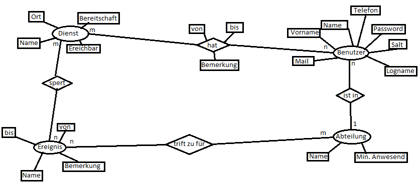
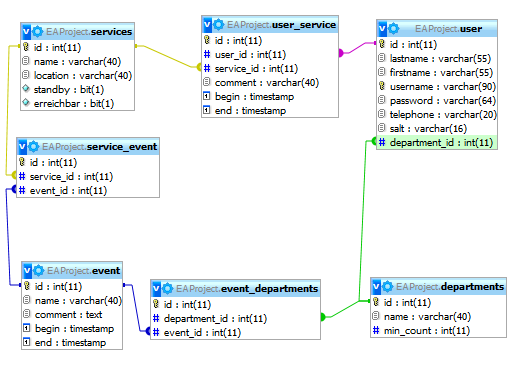

# Projekt EA - Urlaubsverwaltung
**Beteiligte Personen:**
Jonas Arndt, Emre Konar, Daniel Treptow

##Projektbeschreibung

Es soll eine Datenbank erstellt werden in der Dienste/ Urlaube/ und die zugeordneten Personen gespeichert werden.  
In der benuutzeroberfläche kann sich der Benutzer nach erfolgreicher Verifizierung seine Dienste u Urlaube Planen ( Einsehen, Anlegen, ändern, löschen).  
Zur auswertung der Urlaube aller Mitarbeiter gibt es einen Admin Zugang.  

##Features

* Filterung nach Abteilungen
* Filterung nach Zeiträumen
* Dienste müssen vom Chef genehmigt werden.
* Es können vom Admin Ereignisse angelegt werden (zB.: Urlaubsperre die nur bestimmte Abteilungen betreffen)
* Warnungen bei sich überschneidenden Urlauben
* Warnungen bei leeren Abteilungen

##ERM

##Datenbank Struktur

###services

| key | type | xtra |
| --- | --- | --- | 
| id  | int(11) | PK |
| name  | varchar(40) |
| location  | varchar(40) |
| standby  | bit(1) |
| available  | bit(1) |

###service_event

| key | type | xtra |
| --- | --- | --- | 
| id  | int(11) | PK |
| servie_id  | int(11) | FK |
| event_id  | int(11) | FK |

###event

| key | type| xtra |
| --- | --- | --- | 
| id  | int(11) | PK |
| begin  | timestamp |
| end  | timestamp |
| name  | varchar(40) |
| comment  | text |

###event_departments

| key | type| xtra |
| --- | --- | --- | 
| id  | int(11) | PK |
| department_id  | int(11) | FK (departments) |
| event_id  | int(11) | FK (event) |

###departments

| key | type | xtra | 
| --- | --- | --- | 
| id  | int(11) | PK |
| name  | varchar(40) |
| min_count  | int(11) |

###user

| key | type | xtra |
| --- | --- | --- | 
| id  | int(11) | PK |
| department_id  | int(11) | FK |
| lastname | varchar(55) |
| firstname  | varchar(55) |
| username | varchar(90) |
| password  | varchar(64) |
| salt | varchar(16) |
| telephone  | varchar(20) |

###user_service

| key | type | xtra |
| --- | --- | --- | 
| id  | int(11) | PK |
| user_id  | int(11) | FK |
| service_id | int(11) | FK |
| comment  | text |
| begin | timestamp |
| end  | timestamp |

##UserInterface
